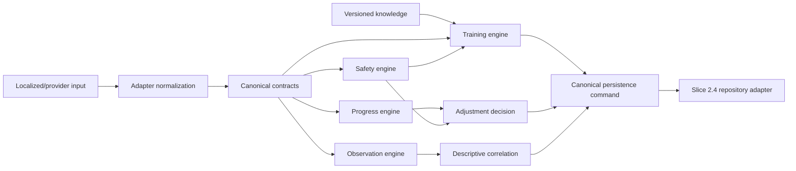

# Deterministic Engine Boundaries

## Dependency Direction



Localized text and provider payloads terminate at adapters. Engines receive canonical codes and validated facts. Presentation locale is visible to eligibility only for production release gating of safety-critical content. Currency is absent from engine contracts. Jurisdiction is ignored by development training logic and used only for production protocol approval.

## Trust Boundary

Safety, eligibility, progression, adjustment, and escalation are deterministic functions. An LLM may later help extract candidate facts or draft human-facing wording, but it cannot issue a canonical decision. Candidate facts must pass canonical validation and preserve unknowns before reaching an engine.

Every decision carries evidence IDs, stable reason codes, and exact engine/rule versions. Timestamps and IDs are supplied by callers; core engines do not read clocks, generate random IDs, call networks, or mutate persistence.

## Execution Order

1. Normalize a versioned intake into canonical anamnesis and context.
2. Run safety assessment. Any non-low-risk disposition blocks autonomous plan generation.
3. Select one measurable, active top-priority goal.
4. Evaluate versioned protocol eligibility.
5. Generate a plan that freezes protocol and rule versions and copies its boundaries.
6. Validate session evidence, observations, and unknown values.
7. Evaluate ten progress dimensions and deterministic confidence.
8. Optionally emit qualified descriptive correlations.
9. Adjust through the fixed safety-first precedence table.
10. Convert the result to a canonical persistence command at the outer boundary.

## Breed Boundary

Breed status and labels are context only. Safety and behavior decisions cannot branch on breed. A breed-related physical limitation affects eligibility only when represented as an explicit sourced physical-constraint code. Unsupported breed facts have no decision path.

## Persistence Compatibility

Slice 2.3 intentionally does not add repositories. The future flow is:

```text
database row -> mapper -> canonical contract -> engine
             -> canonical decision -> persistence command -> repository
```

Two Slice 2.2 schema mismatches are isolated for Slice 2.4:

1. `api.canonical_code` accepts lowercase dotted codes, while the approved persisted engine reason-code contract uses uppercase underscore constants such as `SAFETY_SUSPECTED_PAIN`. A migration or explicit storage encoding must be approved before decisions can be persisted.
2. Database measurement source uses `user_report`; the canonical contract uses `owner_report`. The row mapper explicitly translates `user_report` to `owner_report` and maps the reverse direction for persistence.

Additional persistence mapping is required for database dotted disposition/status codes versus canonical engine enums. Engines must not be changed merely to mirror storage representation.

## Production Gate

Development fixtures cannot become production content by configuration accident. Production eligibility rejects development-only, unapproved, expired, wrong-jurisdiction, wrong-channel, wrong-rule-version, and unreleased safety-critical localized content. No fixture currently passes these gates.
